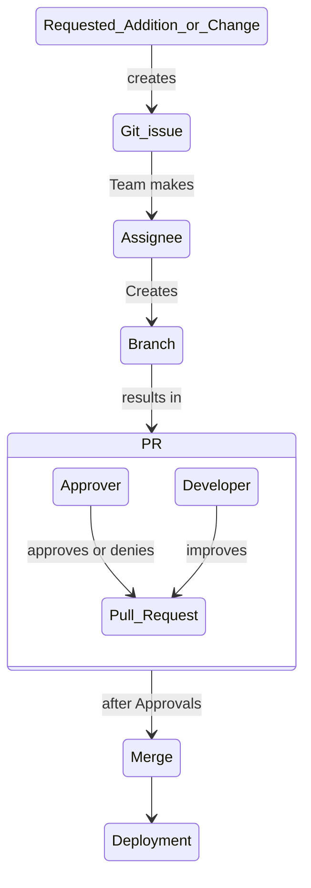

# Git und GitHub



Wir benutzen für die Versionierung und Verwaltung unseres Quellcodes Git und des Service GitHub. Damit sorgen wir für nachvollziehbare Änderungen und können bei Problemen auf eine vorherige Version wechseln ("Rollback").

Für den problemlosen Umgang haben wir folgende Regelnn festgelegt:

1. Alle Änderungen werden möglichst als Tickets (bei GitHub *Issues* genannt) festgehalten
2. Eine Änderung des Codes erfolgt in einem eigenen *Branch*. Erstelle den Branch als `feature`, `bug` oder `housekeeping` indem du die Art und den Ticketnamen miteinander so kombinierst: `feature/17-Sign-up-Link-for-events`. Format:
```
[ART]/[TICKET-NUMMER]-[TICKET-NAME]
```
3. Änderungen werden über bestätigte (*approved*) Pull Requests eingespielt. Nur in Ausnahmefällen (bspw. keine Reviewer) kann der PR ohne Approvals mit dem `master`-Branch zusammengeführt werden.
4. Es werden keine direkte *Commits* auf den Branch `master` ohne Pull Request durchgeführt. Wir wollen nur fertige und getestete Codeänderungen und Funktionen in `master` haben.

## Getting Startet: Deine erste Änderung
1. Plane deine Änderungen zuerst, bevor du direkt den Code veränderst. Das verhindert mehrfache vor-zurück Änderungen. Jede Änderug wird dann gebündelt als `Commits` zurück in den Branch gepusht. Versuche deine Änderungenn so klein wie möglich aber so reichhaltig wie nötig zu halten, damit - falls du mal einen Commit zurückziehen musst - du zu jedem Zeitpunnkt ein funktionierendes System hast.
2. Wenn du deine Änderungen durchgeführt hast, eröffne einen *Pull Request* (kurz: PR) von deinem Branch zu `master` und teile dem Team mit, dass ein PR offen ist und du Reviewer brauchst.
3. Nachdem dein PR bestätigt wurde und es keine Beanstandungen gibt, kannnst du die Änderungen mit dem `master`-Branch zusammenführen (*merge*)
4. Zuletzt musst du deine Änderungen "deployen", heißt auf den Server hochladen.

## Tips und Tricks
- Commits können Emojis beinhalten, um scheller Bugfixes, Refactorings, neue Features und Abhängigkeiten zu anderen Frameworks und Bibliotheken sichtbar zu machen. GitHub zeigt Emojis über Emoji-Codes an. Generell werden in unseren Projekten folgende Emojis verwendet:
  - :tada: Initial commits `:tada:`
  - :sparkles: New features / classes `:sparkles`
  - :bug: Bug `:bug:`
  - :recycle: Refactoring `:recycle:`
  - :heavy_plus_sign: Dependency hinzugefügt `:heavy_plus_sign:`
  - :heavy_minus_sign: Dependency entfernt `:heavy_minus_sign:`
  - :fire: Code oder Dateien entfert `:fire:`
- Schreibe sinnvolle und nachvollziehbare Commit Messages
  - Maximal 50 Zeichen
  - In Präsenz und auf Englisch. Beispiel: `Add new event handler`
  - Sinhafte Messages. Vermeide Messages wie `try smth`
- **Führe einen Commit standard ein und behalte ihn bei.** Commits mit Punkt am Ende?

Andere Emojis: <https://gitmoji.carloscuesta.me/>

## Troubleshooting

- Alle nicht-committete Änderungen zurücksetzen: `git reset --hard`
- Änderungen für später speichern: `git stash`
- Aktuelle Änderugen: `git status`
- Submodules sind nicht geladen: `git submodule update --init --recursive`
